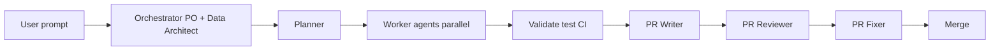

# Multi-agent product engineering blueprint

This repository is a **reusable blueprint**: Cursor agents, standards, and workflows define how **every user prompt** should flow from interpretation through delivery.

## 1. Architecture overview

| Layer | Responsibility |
| --- | --- |
| **Orchestrator** | Single entry: business goal, architecture sketch, data model, constraints, NFRs (performance, cost, security), `correlation_id`, optional `jira_required`. |
| **Planner** | Epics, stories, technical tasks, DAG, parallel groups, agent assignments. |
| **Workers** | Specialized implementation and analysis (see §3). |
| **Validation** | Tests, CI, security checks; Cost/Security agents as gates. |
| **PR pipeline** | PR Writer → Reviewer → Fixer → merge via `git` / `gh`. |

Canonical Cursor stubs include **consolidated** entries (`github-pr-lifecycle.md`, `jira-story-generator.md`, `cost-optimizer.md`, `data-platform.md`) plus per-role stubs (e.g. `orchestrator.md`, `tester.md`). Deep prompts and tools: `agents/<role>/`. Registry: `config/agents.json`.

## 2. Repository layout (blueprint)

| Path | Purpose |
| --- | --- |
| `.cursor/agents/` | Cursor-facing agent definitions (YAML + role doc). |
| `agents/` | Rich agent packages: `agent.md`, `prompt.md`, `tools.json`, `constraints.md`. |
| `standards/` | `coding.md`, `architecture.md`, `data.md`, `testing.md`, `security.md`, `cost.md`. |
| `workflows/` | `orchestration.md`, `planning.md`, `execution.md`, `pr-process.md`. |
| `config/` | `agents.json`, `orchestration.json`, guardrails and skills registry. |
| `docs/` | This blueprint and supplementary architecture notes. |

This repo is **Python-heavy** (data platform orchestration). **Backend** and **frontend** agents apply when the product includes services or UIs; they own agreed directories or branches in consumer repos.

## 3. Agent definitions (summary)

For each agent, **inputs** are what it must receive; **outputs** are what it must produce before handoff.

### Orchestrator (mandatory entry)

- **Responsibilities:** Interpret prompt; clarify ambiguities; define goal, architecture, data model, constraints, NFRs; set standards pointers.
- **Inputs:** Raw user prompt, repo context, policy/guardrails.
- **Outputs:** Structured work order (markdown or JSON handoff), `correlation_id`, flags like `jira_required`.
- **Constraints:** No implementation; no skipping Planner for substantive work.
- **Standards:** `standards/architecture.md`, `standards/data.md`, `standards/security.md`, `standards/cost.md`.
- **Tools:** Read-only exploration first; MCP as configured; no destructive git without explicit instruction.

### Planner

- **Responsibilities:** Break orchestrator output into epics/stories/tasks; DAG; parallel groups; assign workers.
- **Inputs:** Orchestrator work order.
- **Outputs:** Task graph with dependencies and agent ids; optional Jira backlog updates.
- **Constraints:** Atlassian MCP only where `planner-jira-atlassian-mcp` allows; balanced Jira policy.
- **Standards:** `standards/architecture.md`, `workflows/planning.md`.
- **Tools:** Atlassian MCP (when enabled), file read, config read.

### Jira Story Generator (`jira_story_generator` / Cursor: `jira-story-generator`)

- **Cursor stub:** `.cursor/agents/jira-story-generator.md` (single file; DAG id uses underscore in `config/agents.json`).
- **Responsibilities:** Create/update Jira issues via **Atlassian MCP** only; no ticket-text-as-deliverable when MCP can run.
- **Inputs:** Work order, task list, acceptance criteria seeds, `jira_required` / policy.
- **Outputs:** Issue keys + URLs; optional `agents/jira_story_generator.py` for batch.
- **Constraints:** `.cursor/rules/jira-atlassian-mcp-stories.mdc`.
- **Tools:** Atlassian MCP.

### Backend Developer (`backend`)

- **Responsibilities:** APIs, services, jobs, infra-as-code for compute/data paths as scoped.
- **Inputs:** Task spec, interfaces, `correlation_id`.
- **Outputs:** Code + tests in owned paths; no unrelated refactors.
- **Constraints:** Respect security and cost standards; no secrets in repo.
- **Standards:** `standards/coding.md`, `standards/architecture.md`, `standards/security.md`.
- **Tools:** Repo tools, tests, linters, optional cloud CLI per project.

### Frontend Developer (`frontend`)

- **Responsibilities:** UI/UX implementation per design and API contracts.
- **Inputs:** Task spec, API/schema contracts, design tokens.
- **Outputs:** Components, E2E/unit tests as applicable.
- **Constraints:** Same as backend for secrets and accessibility baseline.
- **Standards:** `standards/coding.md`, `standards/testing.md`.
- **Tools:** Package manager, browser MCP if used for verification.

### Data platform (`data_governance`, `data_engineer`, `data_quality`)

- **Cursor stub:** `.cursor/agents/data-platform.md` — three sections map to **`agents/data_governance/`**, **`agents/data_engineer/`**, **`agents/data_quality/`** (registry keeps **three** ids; do not merge the DAG).
- **Responsibilities:** Governance (contracts, lineage, policy) → engineering (pipelines, jobs, catalog) → quality (validation vs contracts)—see each package `agent.md` for inputs/outputs/tools.
- **Standards:** `standards/data.md`, `standards/security.md` where applicable.

### Tester (`tester`)

- **Responsibilities:** Test plans, automation, coverage gaps.
- **Inputs:** Implementation branch, acceptance criteria.
- **Outputs:** Tests, CI signals, defect notes.
- **Constraints:** Does not merge PRs.
- **Standards:** `standards/testing.md`.
- **Tools:** `pytest`, CI, coverage.

### Security Engineer (`security`)

- **Responsibilities:** Secrets, privacy, access control review; block unsafe patterns.
- **Inputs:** Diff, architecture notes, data classifications.
- **Outputs:** Findings, severity, must-fix vs advisory.
- **Constraints:** Can block merge on critical issues.
- **Standards:** `standards/security.md`.
- **Tools:** Static analysis, dependency audit, secret scanners.

### Data Analyst (`data-analyst`)

- **Responsibilities:** Metrics, dashboards, analytical validation of deliverables.
- **Inputs:** Data outputs, business questions from orchestrator.
- **Outputs:** Analysis artifacts, dashboard specs.
- **Constraints:** Read-only on production unless explicitly approved.
- **Standards:** `standards/data.md`.
- **Tools:** SQL, BI tools, MCP data sources as configured.

### Data Scientist (`data-scientist`)

- **Responsibilities:** Experiments, models, offline evaluation (when in scope).
- **Inputs:** Problem framing, datasets, constraints.
- **Outputs:** Notebooks/reports, reproducible training scripts, model cards.
- **Constraints:** No undeclared data egress; reproducibility.
- **Standards:** `standards/data.md`, `standards/testing.md`.
- **Tools:** Python/R stack per project.

### Cost / FinOps (`cost_optimizer`)

- **Cursor stub:** `.cursor/agents/cost-optimizer.md` → **`agents/cost_optimizer/`** (registry id `cost_optimizer`). FinOps estimates, inefficiency flags; advisory unless policy elevates to merge blocker. **Related DAG role:** **`devops`** stays separate — `.cursor/agents/devops.md`.
- **Standards:** `standards/cost.md`, `standards/architecture.md`.

### GitHub / PR lifecycle

- **Cursor stub:** `.cursor/agents/github-pr-lifecycle.md` — one entry for PR **description** (`github_pr_description_writer` → `agents/github_pr_description_writer.py`), **review / fix / re-review / auto-merge** (`agents/pr_review_agent/`, `pr_fixer_agent`, `pr_rereview_agent`, `auto_merge_agent`), and **traceability** audits (`github/pr_templates.py`, `.cursor/rules/traceability-jira-github.mdc`). Use the stub section that matches the task.
- **Tools:** `git`, `gh`, `GitHubClient`, `python -m orchestrator.pr_lifecycle_orchestrator` (see `.cursor/skills/pr-lifecycle-github/SKILL.md`).

## 4. Parallel execution model

- **Independence:** Tasks with no dependency edge may run in parallel (e.g. Security review vs unit tests).
- **Ownership:** Each task owns a branch prefix, directory set, or file list from the Planner to avoid clobbering.
- **Synchronization:** Contract freeze on shared APIs/schemas; integration branch merges at increment end.
- **Conflicts:** If two tasks touch the same file, Planner serializes or splits tasks; escalations go back to Orchestrator for scope arbitration.

## 5. Enforcement rules

1. **All prompts** are interpreted by the Orchestrator first (conceptually); workers consume **planned tasks**, not raw ad-hoc scope creep.
2. **No agent** implements without a **task id** from the Planner for that increment.
3. **All changes** go through the **PR process** (`workflows/pr-process.md`) for protected branches.

Cursor rules under `.cursor/rules/` reinforce DAG and guardrails; `config/agents.json` documents the graph for automation.

## 6. Example execution flow

1. **User:** “Add a dbt model for daily revenue by region with tests and a PR.”
2. **Orchestrator:** Clarifies sources, grain, PII, SLA; outputs work order + `correlation_id`, `jira_required: false`.
3. **Planner:** Tasks — (A) governance check on sources, (B) dbt model + tests, (C) cost note on incremental strategy, (D) PR description. Marks A → B dependency; C parallel to B after governance; D after CI green.
4. **Workers:** Data governance → Data engineer → Cost analyst (parallel where allowed) → Tester → PR Writer.
5. **PR:** Reviewer approves or Fixer addresses; merge via `gh`.

## 7. Cost and performance governance

- **Orchestrator** captures NFRs (latency, batch windows, budget caps).
- **Cost Analyst** estimates and flags expensive patterns (full scans, oversized clusters).
- **Data Architect lens** in Orchestrator pushes scalable partitioning, incremental processing, and right-sized resources.

## 8. Security layer

- **Security** agent validates secrets handling, data minimization, access boundaries.
- **Block** criteria: hardcoded secrets, public exposure of private data, missing auth on sensitive paths (per policy).

---

For day-to-day Cursor usage, start from **`workflows/orchestration.md`**, pick the matching stub in **`.cursor/agents/`** (§3), and obey **`standards/`** for consistency across projects that adopt this blueprint.
